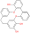

# cdk-inchi-to-svg
Version: 0.9

## Short Description
Convert an InChI string to a SVG file

## Description
This Java tool converts an InChI string to a SVG file.

It was written in Java and requires the [Chemistry Development Kit (CDK)](https://cdk.github.io) and [Maven](https://maven.apache.org) to be compiled from source.

## Example
Usage on the command line:
```SH
java -jar cdk-inchi-to-svg-0.9-SNAPSHOT-jar-with-dependencies.jar 'InChI=1S/C28H24O5/c29-24-6-2-4-21-12-9-18-10-13-22(14-11-18)32-26-17-20(16-25(30)27(26)31)8-7-19-3-1-5-23(15-19)33-28(21)24/h1-6,10-11,13-17,29-31H,7-9,12H2' example.svg
```

Usage of the docker container:
```SH
docker run -v `pwd`:`pwd` -w `pwd` -ti ipb-halle/cd-inchi-to-svg 'InChI=1S/C28H24O5/c29-24-6-2-4-21-12-9-18-10-13-22(14-11-18)32-26-17-20(16-25(30)27(26)31)8-7-19-3-1-5-23(15-19)33-28(21)24/h1-6,10-11,13-17,29-31H,7-9,12H2' example.svg
```

Result:




The above image shows the structure of Marchantin A.

## Approaches

- Chemistry / Biochemistry
- Cheminformatics / CDK
- Metabolomics / Untargeted
- Metabolomics / Targeted

## Tool Authors
- René Meier
- Kristian Peters

## Publications

